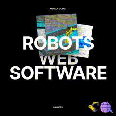

### Hello and welcome to my profile ! I am Arnaud aka [Godeta][CV_website]

## I am an engineer
- Robotics : [kuka control big 1 year project][torus] , [Arduino input to robot][esplora] and [signal processing][sign]
- Game dev : [godot][gdt] [Unity][uni]
- Working with OOP using Java : [tic tac toe in command line][Gobblet-Gobblers] and [test animated game with swing][javaFirstAnimation] 
- Web developpement, [front-end there][front] and [back-end here][back]
- Some AI : [flappyBird ][flappy] [licence plate reader][plate]
- Networking : [Online Multiplayer Agario ][agario]
- Web scraping : [Geneanet Scraper project ][geneanet]
- Databases : [Library using Mongodb with node js][library] and [SQL queries with some php][sql manip]
- My resumee : [Arnaud GODET resumee](https://godeta.github.io)

### Connect with me

[][CV_website]
[][linkedin]

---

[CV_website]: https://windy-paradox-f12.notion.site/CV-9e48da96b2264f5eb95596907fa01d1c
[linkedin]: https://www.linkedin.com/in/arnaud-godet-b633021a6/
[Gobblet-Gobblers]: https://github.com/Godeta/Gobblet-Gobblers-Java
[esplora]: https://github.com/Godeta/controle_robot_manette
[sign]: https://github.com/Godeta/signal_processing
[torus]: https://github.com/Godeta/proof_of_concept_TORUS
[front]: https://github.com/Godeta/WellDesignedWebsites
[back]: https://github.com/Godeta/NodeJS_WeatherLocation
[flappy]: https://github.com/Godeta/FlappyBird-JS
[plate]: https://github.com/Godeta/licence_plate_reader
[gdt]: https://github.com/Godeta/godot_simple_games
[uni]: https://github.com/Godeta/UnityBasics
[agario]: https://github.com/Godeta/Agario_JS_multi
[geneanet]: https://github.com/Godeta/Geneanet_toGedcom_webScraping
[javaFirstAnimation]: https://github.com/Godeta/JavaFirstAnimation
[library]: https://github.com/Godeta/Library_nodeJS-Express-MongoDB
[sql manip]: https://github.com/Godeta/SQL_manipulation
